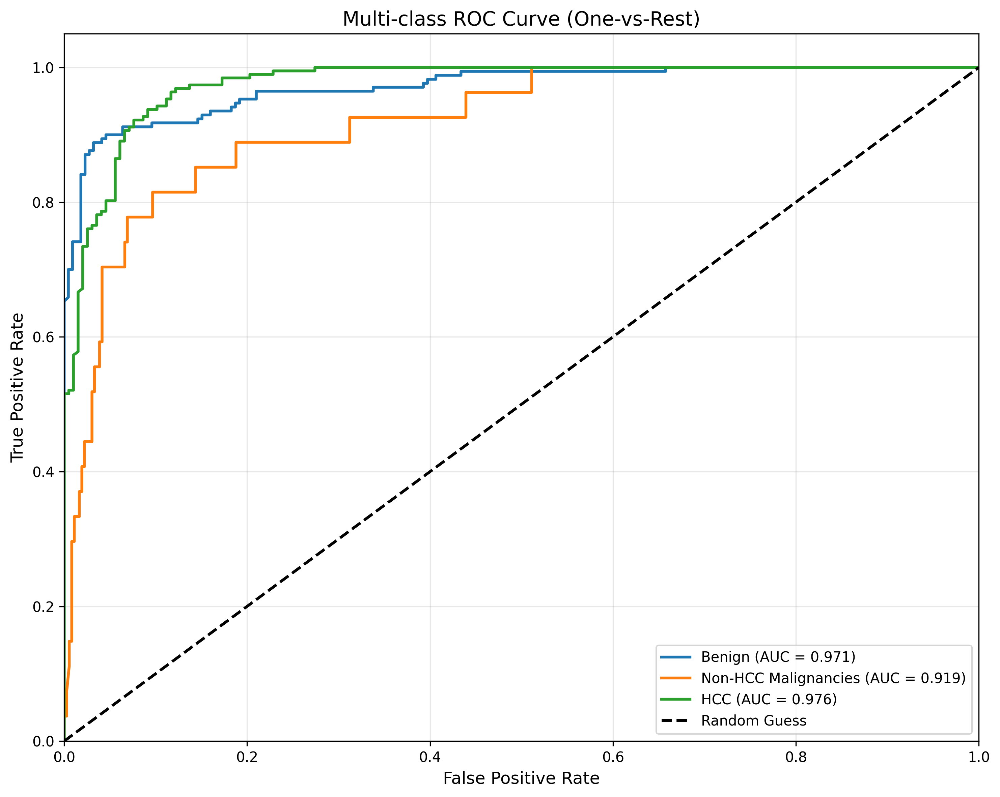
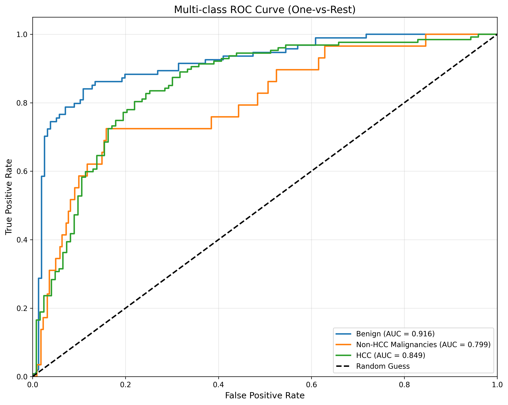

<div align="center">

# 可解释 AI 肝癌诊断系统

**高风险背景下肝脏局灶性病变的良恶性识别与 HCC 精准诊断**

[](https://www.python.org/)
[](https://pytorch.org/)
[](https://developer.nvidia.com/cuda-toolkit)
[](https://github.com/rwightman/pytorch-image-models)

</div>

---

## 目录

- [简介](#简介)
- [三分类诊断性能](#三分类诊断性能)
- [系统架构](#系统架构)
- [项目结构](#项目结构)
- [快速开始](#快速开始)

## 简介

本项目构建一个**可解释的两阶段 AI 系统**，面向肝硬化等高风险背景：先由分割模型从四期增强 CT 中检出肝脏局灶性病变，再由诊断模型将其判定为 **良性 / 恶性非 HCC / HCC** 三类，并通过概念归因（TCAV）给出可解释的影像征象依据。

## 三分类诊断性能

诊断模型将病灶分为 **良性 / 恶性非 HCC / HCC** 三类。以下为融合临床变量的诊断模型在**内部验证集**与**外部测试集**上的性能

**各类别 AUC**

| 类别 | 内部验证 | 外部测试 |
|:---|:---:|:---:|
| 良性 | 0.971 | 0.916 |
| 恶性非 HCC | 0.919 | 0.799 |
| HCC | 0.976 | 0.849 |
| **Macro 平均** | **0.955** | **0.855** |

**ROC 曲线**（最终模型：影像 + 征象 + 临床变量）

| 内部验证集 | 外部测试集 |
|:---:|:---:|
|  |  |

**总体指标**

| 指标 | 内部验证 | 外部测试 |
|:---|:---:|:---:|
| Accuracy | 0.895 | 0.764 |
| Macro-F1 | 0.897 | 0.755 |
| Macro-AUC | 0.955 | 0.855 |
| Kappa | 0.814 | 0.588 |


## 系统架构

### 阶段一 · 病灶检测（nnU-Net v2）

基于 nnU-Net v2 的 3D 分割模型，输入配准对齐后的四期增强 CT（动脉期 A / 门脉期 P / 延迟期 D / 平扫 S），输出病灶分割掩膜（ROI）。针对病灶前景占比极小的问题，采用自定义 Trainer `nnUNetTrainer_smallROI`（前景过采样）与 `FocalDiceLoss` 以提升小目标敏感度。

### 阶段二 · 三分类诊断（LIFT：Transformer + TCAV）

以检测出的病灶为输入，端到端 Transformer（Uniformer-B，加载 Kinetics-400 预训练权重）联合**概念激活向量（TCAV）**，将模型决策关联到可理解的影像征象（动脉期高强化、非周边廓清、包膜强化、马赛克结构等），输出 LR 分级与三分类结果。诊断模型按是否融合临床变量分为两个：

| 模型 | 输入 | 输出 |
|:---|:---|:---|
| 模型 1 | 病灶多期影像 + 征象 | LR 分级 + HCC三分类 + 征象归因 |
| 模型 2 | 病灶多期影像 + 征象 + 临床变量 | HCC三分类 |

## 项目结构

```text
LR-HCC/
├── readme.md                   # 项目说明（本文件）
├── requirements.txt            # Python 依赖
├── scripts/                    # 全部脚本，按功能分类（均从项目根目录运行）
│   ├── preprocessing/          # 预处理：preprocess / rebuild_labels / remove_small_label_cases / convert_json_to_csv
│   ├── prediction/             # 训练与推理入口：main / predict_smallROI / predict_features / predict_features_3class
│   ├── analysis/               # 对比与统计：compare_* / generate_baseline_table / shap_analysis
│   ├── visualization/          # 可视化：visualisation / visualization_original / render_mermaid
│   └── run_subcv.sh            # 5 折子交叉验证训练流水线
├── nnunetv2/                   # 检测模型：自定义 nnU-Net v2 Trainer(smallROI) 与损失(FocalDice)
├── LIFT/                       # 诊断模型：Transformer + TCAV 代码、权重与预测（独立子仓库）
├── tool/                       # 辅助工具：标签检查、训练曲线绘制、本地训练
├── result_test/                # 分割 / 检测评估脚本与结果
├── shap_outputs/               # SHAP、t-SNE 归因分析脚本与结果
├── 附件/                        # 流程图配图与病例数据表
├── 流程图/                      # 流程图源文件
├── data/                       # nnU-Net 原始 / 预处理 / 结果数据（不纳入版本控制）
├── 外部验证集/                   # 外部验证数据（不纳入版本控制）
├── results/                    # 特征预测结果 csv（不纳入版本控制）
├── model_comparison_results/   # 模型对比图表（不纳入版本控制）
├── visualization_output/       # 可视化输出（不纳入版本控制）
└── docs/                       # 分析报告等文档（不纳入版本控制）
```

## 快速开始

```bash
# 环境要求：Python 3.8+，CUDA 11.3
pip install -r requirements.txt

# 数据预处理（四期 CT 配准对齐 + 标签生成）
python scripts/preprocessing/preprocess.py

# 检测模型全流程：预处理 + 训练 + 预测 + 评估
python scripts/prediction/main.py --dataset_id 001

# 诊断模型 5 折子交叉验证训练
bash scripts/run_subcv.sh
```
