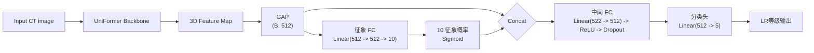
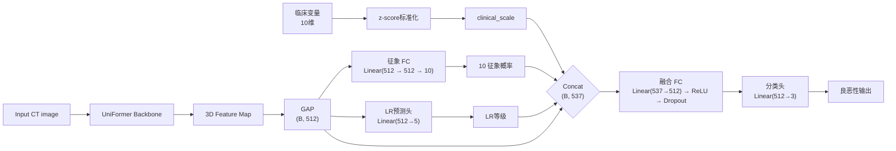

**2.2.1 模型1：DL+征象 -> LR等级**

```mermaid
graph LR
    A["Input CT image"] --> B["UniFormer Backbone"]
    B --> C["3D Feature Map"]
    C --> D["GAP<br/>(B, 512)"]
    D --> E["征象 FC<br/>Linear(512 -> 512 -> 10)"]
    E --> F["10 征象概率<br/>Sigmoid"]
    D --> G{"Concat"}
    F --> G
    G --> H["中间 FC<br/>Linear(522 -> 512) -> ReLU -> Dropout"]
    H --> I["分类头<br/>Linear(512 -> 5)"]
    I --> J["LR等级输出"]
```
**2.2.2 模型2: DL+征象 -> 良恶性**

```mermaid
graph LR
    A["Input CT image"] --> B["UniFormer Backbone"]
    B --> C["3D Feature Map"]
    C --> D["GAP<br/>(B, 512)"]
    D --> E["征象 FC<br/>Linear(512 -> 512 -> 10)"]
    E --> F["10 征象概率<br/>Sigmoid"]
    D --> G{"Concat"}
    F --> G
    G --> H["中间 FC<br/>Linear(522 -> 512) -> ReLU -> Dropout"]
    H --> I["分类头<br/>Linear(512 -> 3)"]
    I --> J["良恶性输出"]
```

**2.2.3 模型3：DL+征象+LR等级+临床变量->良恶性**

```mermaid
graph LR
    P["临床变量<br/>10维"] --> P2["z-score标准化"]
    P2 --> P3["clinical_scale"]
    P3 --> G
    A["Input CT image"] --> B["UniFormer Backbone"]
    B --> C["3D Feature Map"]
    C --> F["GAP<br/>(B, 512)"]
    F --> E["征象 FC<br/>Linear(512 → 512 → 10)"]
    E --> E2["10 征象概率"]
    F --> L["LR预测头<br/>Linear(512→5)"]
    L --> M["LR等级"]
    E2 --> G
    M --> G
    F --> G{"Concat<br/>(B, 537)"}
    G --> H["融合 FC<br/>Linear(537→512) → ReLU → Dropout"]
    H --> I["分类头<br/>Linear(512→3)"]
    I --> J["良恶性输出"]
```
